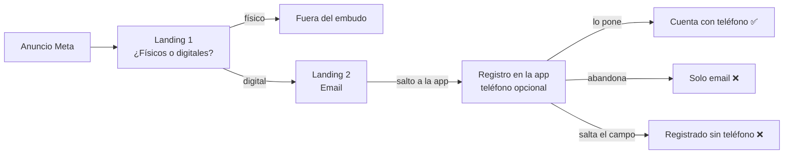
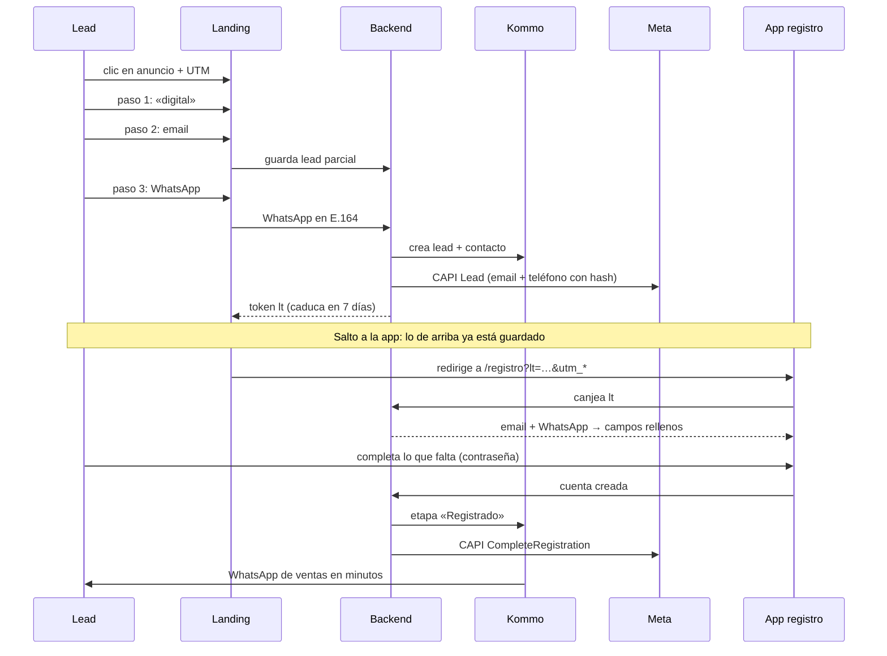

# Embudo con WhatsApp obligatorio

**Fecha:** 7 de octubre de 2026
**Versión visual (diagramas, pantallas y calculadora):** https://claude.ai/artifact/XReNeBFSjSGsfjH3p7n9Wz

**Problema:** el lead del anuncio pasa por la landing que cualifica (¿productos físicos o digitales? → email) y entra al registro de la app sin teléfono. Como el teléfono era opcional, muchos se registran sin él y ventas no puede hablarles.

---

## La recomendación

| | |
|---|---|
| **Dónde pedirlo** | En la landing, como paso 3: después de la pregunta y del email. |
| **Por qué ahí** | Es lo último antes del salto a la app. Si el lead abandona el registro, ventas ya tiene su WhatsApp y su email. |
| **Cómo llega al registro** | Con un token en la URL (`?lt=…`). El registro lo canjea y rellena email y WhatsApp. Las UTM siguen viajando, pero solo para atribución: **el email y el teléfono nunca van en la URL**. |
| **Qué se descarta** | Google (no entrega el teléfono y no funciona en el navegador de Instagram/Facebook) y el estilo Stripe (quita la pregunta que filtra al pixel). |

## Hoy

## Las opciones

Lo que decide todo: **el WhatsApp tiene que capturarse antes del salto a la app**. Lo que no se captura antes se pierde con quien abandona el registro.

| Opción | ¿Dónde se captura el WhatsApp? | Si no termina el registro, ¿hay WhatsApp? | ¿El pixel sigue filtrando? | Veredicto |
|---|---|---|---|---|
| 0 · Obligatorio solo en el registro | Registro (app) | No | Sí | Hazla también, para quien llega sin landing |
| 1 · Google en la landing | Google no lo da: hay que pedirlo igual | No | Sí | Descartar |
| **2 · Email + WhatsApp en la landing** | **Landing, antes del salto** | **Sí** | **Sí, con email + teléfono** | **Recomendada** |
| 3 · Solo WhatsApp en la landing | Landing, antes del salto | Sí, pero sin email | Sí | Plan B si el paso 3 cae mucho |
| 4 · Registro completo en la landing | Landing (todo el registro) | No, si no lo envía | Sí | No ahora: la 2 consigue lo mismo con menos |
| 5 · Estilo Stripe (landing + botón) | Registro (app) | No | No | Descartar en anuncios; vale para orgánico |

**Google:** «Continuar con Google» da nombre y email. El teléfono pide un permiso sensible aparte (otra pantalla, revisión de Google) y solo llega si el usuario lo tiene en su perfil. Además, el anuncio abre la landing en el navegador interno de Instagram/Facebook, donde Google bloquea el inicio de sesión (`403 disallowed_useragent`).

**Stripe:** puede ir directo al registro porque su tráfico ya llega con intención y no necesita hablar con cada registro. Con tráfico frío de Meta, sin la pregunta el pixel deja de distinguir digital de físico, y el teléfono vuelve a quedar en el registro.

## Flujo recomendado

Si a los 30 min no se registró: Salesbot manda «te falta un paso» con el enlace y el mismo token.

## Textos propuestos

- **Paso 1:** «¿Qué tipo de productos vendes?» → Digitales (cursos, membresías, mentorías, comunidades) / Físicos.
- **Paso 2:** «¿Con qué email creamos tu cuenta?» → Continuar.
- **Paso 3:** «Último paso: tu WhatsApp» · «Alguien del equipo te escribe por aquí para ayudarte a activar tu cuenta.» · campo con prefijo +34 y validación en vivo · «Crear mi cuenta» · «Solo te escribimos sobre tu cuenta. Al continuar aceptas que te contactemos por WhatsApp. Privacidad».
- **Registro:** email y WhatsApp prellenados y editables; solo falta la contraseña.

## ¿Compensa?

- Hoy, contactables = visitas × % email × % termina registro × % pone teléfono.
- Nuevo, contactables = visitas × % email × % deja WhatsApp.
- Sale a cuenta mientras **% deja WhatsApp > % termina registro × % pone teléfono**. Ejemplo: si hoy termina el registro el 50 % y de esos pone teléfono el 45 %, basta con que más del 22,5 % de quienes dejan el email dejen también el WhatsApp.

## Especificación

**Landing**
- `type="tel"`, `autocomplete="tel"`, `inputmode="tel"`; email con `autocomplete="email"`.
- Prefijo por IP (+34 por defecto), validación con `libphonenumber-js`, guardado en E.164 (`+34612345678`).
- Guardar el email al enviarlo (lead parcial), antes de pedir el WhatsApp.
- Un evento de analítica por paso.

**Token y registro**
- Token aleatorio (≥128 bits), caduca en 7 días, solo devuelve email y WhatsApp de ese lead.
- Email y teléfono nunca en la URL ni en las UTM: el pixel de Meta envía la URL completa en cada evento, y Meta marca y puede bloquear eventos con datos personales; además acaban en analítica y logs.
- UTM y `fbclid` pasan intactos al registro.
- WhatsApp obligatorio también para quien llega sin token (orgánico, directo).
- Si el registro es una app nativa, el token viaja con un deep link diferido.

**Kommo**
- Lead creado al enviar el WhatsApp, no al terminar el registro.
- Campos: WhatsApp, email, respuesta del paso 1, `utm_source`, `utm_campaign`, `utm_content`, estado del registro.
- Deduplicar por teléfono.
- Salesbot: primer WhatsApp en minutos; a los 30 min sin registro, «te falta un paso» con el mismo token.

**Meta**
- `Lead` al enviar el WhatsApp, desde pixel y API de conversiones con el mismo `event_id`.
- `em` y `ph` normalizados con SHA-256; `ph` solo dígitos con prefijo (`34612345678`). Más `fbc` y `fbp`.
- `CompleteRegistration` desde el servidor de la app.

**Legal**
- Consentimiento bajo el campo + enlace a privacidad; revisión de legal (RGPD).
- El primer WhatsApp de la empresa debe ser una plantilla aprobada por Meta.

## Cómo medirlo

| Métrica | Qué dice | Dónde |
|---|---|---|
| Coste por lead con WhatsApp válido | Si el cambio compensa (la que manda) | Meta + Kommo |
| Coste por cuenta activada | Si esos leads usan Kunfupay | App + Meta |
| Conversión de cada paso | Dónde se cae la gente | Analítica de la landing |
| WhatsApp entregados y respondidos | Si los números son reales | Kommo |
| Minutos hasta el primer mensaje | Velocidad de ventas | Kommo |

**La prueba:** 50/50 en la landing entre el flujo de hoy y el nuevo, con los mismos anuncios, hasta tener al menos 100 leads por lado y como mínimo dos semanas. Durante la prueba no se cambia el evento de optimización. Cuando gane el nuevo, el evento `Lead` pasa al envío del WhatsApp (Meta reaprende unos días). El coste por lead va a subir porque se cuentan menos leads: es esperado.
