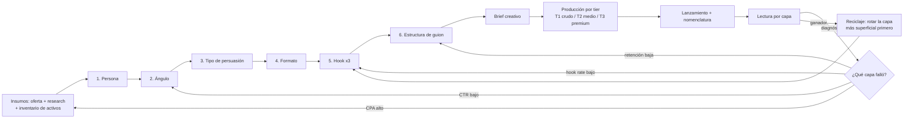

# Flujo de creación de anuncios con diversidad creativa

**Qué es esto:** un proceso definido y repetible para producir anuncios en volumen sin producir *el mismo anuncio doce veces*. Convierte una decisión creativa difusa ("¿qué grabamos esta semana?") en una combinatoria explícita de 6 capas independientes, cada una con su biblioteca, su regla de rotación y su lectura de resultados.

**El motor:** las capas 1 a 6 no se llenan a mano cada semana. Se generan con el **[generador de diversidad creativa](GENERADOR-DIVERSIDAD-CREATIVA.md)**: le entrás una idea y devuelve el árbol completo — perspectivas → tipos de comunicación → formatos de reel → hook y guion. Este documento es el proceso que rodea al generador: de dónde salen sus insumos, cómo se produce lo que genera, cómo se lee el resultado y qué se rota después. Se ejecuta con la skill `/diversidad-creativa "tu idea"`.

**Base de evidencia:** las bibliotecas de formatos, hooks y estructuras de guion están instanciadas con el corpus analizado en [`ANALISIS-REELS-ALEJO-MUNOZZZ.md`](ANALISIS-REELS-ALEJO-MUNOZZZ.md) (100 reels, 47 transcripciones, 48 videos frame a frame). No es teoría prestada: cada formato y cada familia de hook de este sistema tiene un caso medido detrás.

---

## 0. El principio: separar las capas

El error que produce "mucho contenido, cero aprendizaje" es mezclar capas. Se lanza un anuncio nuevo y no se sabe si funcionó por el mensaje, por el gancho o por la estética. Este flujo separa seis decisiones que casi siempre se toman juntas:

| # | Capa | Pregunta que responde | Biblioteca |
|---|---|---|---|
| 1 | **Persona** | ¿A quién le hablamos? | [`bibliotecas/01-personas.md`](bibliotecas/01-personas.md) |
| 2 | **Ángulo** | ¿Qué tesis le sostenemos? | [`bibliotecas/02-angulos.md`](bibliotecas/02-angulos.md) |
| 3 | **Tipo** | ¿Con qué mecanismo lo argumentamos? (autoridad, estadístico, demo…) | [`bibliotecas/03-tipos-persuasion.md`](bibliotecas/03-tipos-persuasion.md) |
| 4 | **Formato** | ¿Cómo se ve y suena? (one-take, conversacional, talking head, IA…) | [`bibliotecas/04-formatos.md`](bibliotecas/04-formatos.md) |
| 5 | **Hook** | ¿Cómo abren los primeros 3 segundos? | [`bibliotecas/05-hooks.md`](bibliotecas/05-hooks.md) |
| 6 | **Estructura** | ¿Cómo se ordena el cuerpo y el CTA? | [`bibliotecas/06-estructuras-guion.md`](bibliotecas/06-estructuras-guion.md) |

Las capas 1 y 2 son insumos del negocio (hay que escribirlas una vez). Las capas 3, 4, 5 y 6 son las que el generador abre automáticamente a partir de un ángulo.

Un anuncio es una **celda** de esa combinatoria: `Persona × Ángulo × Tipo × Formato × Hook × Estructura`. Con 4 personas, 8 ángulos por persona, 14 tipos, 13 formatos y 12 familias de hook el espacio es de decenas de miles de celdas — el problema nunca es "no tengo ideas", es **elegir bien y no repetir celda sin darse cuenta**.

**Las tres reglas que hacen que esto funcione:**

1. **Una capa por vez cuando querés atribuir.** Si cambiás ángulo y formato al mismo tiempo, ganaste un dato y perdiste la causa.
2. **El ángulo se prueba barato antes de producirse caro.** Ningún ángulo entra en producción premium sin haber ganado en producción cruda. El corpus lo demuestra en números: el reel más editado de la cuenta (134 cortes) es el de peor alcance (1.282 views) y el más visto (968k) tiene cero cortes.
3. **El formato es una variable de test, no una decisión estética.** El mismo guion madre del corpus hizo 19.300 views como sketch y 1.800 como talking head editado: **el formato multiplicó por 10 el mismo mensaje**.



---

## 1. Etapa 0 — Insumos (se refresca cada trimestre)

Antes de la primera celda hacen falta cuatro cosas. Sin ellas el sistema gira en falso y produce anuncios genéricos.

**a) Ficha de oferta.** Promesa concreta, mecanismo único (el "cómo" propietario, con nombre propio), precio, qué incluye, garantía, y — clave — **qué pruebas tenemos disponibles hoy** (números, capturas, testimonios, casos, credenciales). El tipo de persuasión que podemos usar en la capa 3 está limitado por esta lista.

**b) Banco de voz del cliente.** Frases **literales** de: comentarios, DMs, llamadas de venta grabadas, tickets de soporte, reseñas de competidores, hilos de Reddit/grupos. Mínimo 50 frases. Este banco es la materia prima de los ángulos y de los hooks — un ángulo escrito desde la oficina se nota; uno copiado de un DM, no.

**c) Inventario de activos y capacidades.** Qué podemos filmar (¿hay fundador on-cam? ¿UGC contratable? ¿solo IA?), qué b-roll propio existe ya catalogado, qué stock/licencias tenemos, qué herramientas. El corpus muestra que el activo más grande de una cuenta es **su propio b-roll reciclado**: sets fijos (estudio, escritorio, auto), props recurrentes y locaciones. Catalogar esto una vez ahorra el 40% del tiempo de producción de cada pieza.

**d) Restricciones de plataforma.** Claims prohibidos, antes/después, categorías especiales, límites de texto. Se anota como checklist para que no se descubra en el rechazo.

---

## 2. Etapa 1 — Persona: de demografía a decisión

Una persona útil no dice "hombre 25-40, interesado en marketing". Dice **qué cree y qué le impide comprar**. Campos obligatorios (ficha completa y ejemplos en [`bibliotecas/01-personas.md`](bibliotecas/01-personas.md)):

- ID (`P01`…`P04`) y una línea de identidad
- **Evento disparador**: qué pasó en su semana para que empiece a buscar
- Dolor funcional / emocional / social (los tres, separados)
- Deseo declarado vs. deseo real
- **Creencia bloqueante**: lo que cree verdadero y le impide avanzar
- Objeciones #1 y #2, textuales
- **Nivel de consciencia** (Schwartz): inconsciente → consciente del problema → de la solución → del producto → de la oferta
- Nivel de sofisticación del mercado (1–5: cuántas promesas parecidas ya escuchó)
- Enemigo percibido
- 3–5 frases literales del banco de voz
- Qué prueba le mueve la aguja

**Regla de foco: máximo 4 personas activas.** Más que eso no es segmentación, es dilución del presupuesto de aprendizaje. Una persona nueva se activa solo cuando otra se retira.

El nivel de consciencia es el campo más operativo de la ficha: determina qué tipos de persuasión y qué estructuras de guion pueden funcionar (ver la matriz de compatibilidad en la biblioteca 03). Hablarle de mecanismo único a alguien que todavía no sabe que tiene el problema es quemar impresiones.

---

## 3. Etapa 2 — Ángulo: la tesis, no el gancho

**Definición operativa.** El ángulo es la **tesis discutible** del anuncio: una frase declarativa que conecta una creencia de la persona con el mecanismo del producto. No es el hook (eso es la capa 5), no es el formato (capa 4), no es el beneficio genérico.

**Fórmula de generación:**

> Para **[persona]** que cree que **[creencia bloqueante]**, el problema real es **[reencuadre]**; por eso **[mecanismo único]** consigue **[resultado concreto]** sin **[objeción/sacrificio que teme]**.

**Las 8 palancas que garantizan diversidad de ángulo.** Cada persona debe generar al menos un ángulo por palanca antes de repetir palanca. Esto es lo que evita el síndrome de "todos nuestros anuncios dicen lo mismo con distinta música":

| Palanca | Pregunta generadora |
|---|---|
| 1. **Dolor / consecuencia** | ¿Qué le está costando hoy no resolverlo? |
| 2. **Deseo / resultado** | ¿Cómo se ve el día después de resolverlo? |
| 3. **Reencuadre** | ¿Qué cree que es el problema y en realidad no lo es? |
| 4. **Objeción como titular** | ¿Cuál es su "sí, pero…" y qué pasa si lo pongo yo primero? |
| 5. **Mecanismo único** | ¿Por qué nuestro cómo es distinto y no solo mejor? |
| 6. **Enemigo / status quo** | ¿Contra qué o quién estamos? |
| 7. **Identidad** | ¿En quién se convierte quien usa esto? |
| 8. **Momento / timing** | ¿Por qué ahora y no en seis meses? |

**Test de calidad — un ángulo pasa solo si cumple los tres:**

1. **Es discutible.** Si nadie razonable podría estar en desacuerdo, no es un ángulo, es un lugar común.
2. **Es nuestro.** Si el anuncio funcionaría igual con el logo de un competidor, el ángulo no tiene mecanismo adentro.
3. **Es reconocible.** La persona diría "esto me pasa" en voz alta, con las palabras del banco de voz.

Cada ángulo aprobado se escribe como una línea en [`bibliotecas/02-angulos.md`](bibliotecas/02-angulos.md) con su ID (`A01`…), su persona, su palanca y su estado (`sin probar` / `probado-perdió` / `probado-ganó` / `agotado`).

---

## 4. Etapa 3 — Tipo: el mecanismo de persuasión

Es el "cómo lo argumentamos" — lo que en la práctica se nombra como *autoridad*, *estadístico*, *prueba social*. Catorce tipos en [`bibliotecas/03-tipos-persuasion.md`](bibliotecas/03-tipos-persuasion.md), cada uno con: qué prueba necesita, a qué nivel de consciencia le habla, riesgo de rechazo en plataforma y costo de producción.

**Reglas de uso:**

- **Un tipo primario por anuncio, un secundario opcional. Nunca tres.** El apilamiento de mecanismos ("dato + autoridad + testimonio + urgencia" en 30 segundos) lee como venta desesperada y baja retención.
- **El tipo está limitado por la ficha de oferta.** Si no hay números auditables, no hay anuncio estadístico honesto; se elige otro tipo en vez de inventar la cifra.
- **El mismo ángulo con dos tipos distintos son dos anuncios distintos, no dos variantes.** Es una de las rotaciones más rentables: el ángulo ya validado, argumentado de otra manera.

Detalle del corpus que vale como regla: **las cifras no redondas rinden más** ($1.497, 17,8%, ROAS 30) porque leen como medición y no como estimación. Aplica a todo tipo estadístico.

---

## 5. Etapa 4 — Formato: la variable con mayor multiplicador

Trece formatos catalogados en [`bibliotecas/04-formatos.md`](bibliotecas/04-formatos.md), cada uno con costo, duración típica, densidad de cortes, quién lo produce y su caso medido en el corpus. Resumen:

| Familia | Cortes/10s | Tier | Para qué sirve |
|---|---|---|---|
| One-take crudo / selfie | 0 | T1 | Alcance frío. Todo el peso en la premisa |
| Conversacional / roleplay a 2 voces | 0–2 | T1 | CTA diegético; mejores ratios de comentario |
| Titular fijo persistente | 0 | T1 | Quien entra en cualquier segundo ve la promesa |
| Demo de pantalla ("filmar el monitor") | 0–1 | T1 | Prueba de que existe y funciona |
| Texto fijo sobre b-roll (6–10s) | 0–4 | T1 | Loop forzado; mínimo esfuerzo |
| Podcast clip / confesional letterboxed | 0 | T2 | Conexión y vulnerabilidad |
| Split-screen cara + pizarra | 0–1 | T2 | Explicar un sistema; "VSL disfrazada" |
| UGC testimonial | 2–6 | T2 | Prueba social a escala |
| Estático / póster / carrusel | — | T1–T2 | Retargeting y oferta directa |
| IA total (avatar + VO + b-roll) | variable | T1–T2 | Volumen de test barato, escala de idiomas |
| Híbrido IA (cara real + b-roll IA) | 6–12 | T2 | Producción premium sin rodaje |
| Talking head editorial lento | 6–11 | T3 | Awareness aspiracional / identidad |
| Documental / exposé narrado | 2–3 | T3 | Autoridad y curiosidad alta |

**Las dos reglas de formato que salen del corpus, no del gusto:**

1. **La densidad de edición correlaciona *inversamente* con el alcance.** Los 5 reels más vistos (~2,27M views combinadas) promedian ~2 cortes/10s. Los 12 hiper-editados de conversión (14–25 cortes/10s) topan en 1.282–3.609 views. Los dos únicos edits que escalaron son los **lentos** (6,8 y 11 cortes/10s). El hypercut de 20+ nunca pasó de 9k. Traducción operativa: el hypercut es un uniforme de fondo de embudo, no un motor de alcance.
2. **El crudo no gana por crudo, gana por premisa.** Cuando la premisa se gasta, el mismo formato colapsa: los tres clones tardíos del sketch que hizo 19k tres veces cayeron a 366, 348 y 306 views. El formato no salva un ángulo agotado.

**Asignación de tier — la regla de inversión escalonada:**

- **T1 (< 1 hora)**: todo ángulo nuevo entra acá. Sin excepción.
- **T2 (2–4 horas)**: solo ángulos que superaron el umbral de hook rate en T1.
- **T3 (1–2 días)**: solo ángulos que ya convirtieron en T2 **y** cuyo guion es muy citable. El corpus muestra el costo de ignorar esto: cinco editores concentrados en la familia que menos alcance genera.

---

## 6. Etapa 5 — Hook: tres por ángulo, siempre

Doce familias de hook documentadas con ejemplos literales y sus métricas en [`bibliotecas/05-hooks.md`](bibliotecas/05-hooks.md).

**Reglas:**

- **Todo ángulo se escribe con 3 hooks de familias distintas.** Es la variante más barata que existe: mismo cuerpo, misma producción, tres aperturas. En el corpus, dos tomas casi idénticas del mismo sketch dieron 19.278 y 306 views — la varianza de apertura y premisa domina todo lo demás.
- **El hook es una unidad de test separada.** Se lanza como tres anuncios, no como uno con tres versiones internas.
- **Los primeros 3 segundos tienen que funcionar sin sonido.** Sea por texto en pantalla, por rostro en primer plano o por movimiento.

---

## 7. Etapa 6 — Estructura de guion

Cinco arquitecturas en [`bibliotecas/06-estructuras-guion.md`](bibliotecas/06-estructuras-guion.md):

1. **Conversión** — hook con cifra (0–4s) → diagnóstico del error (4–10s) → **giro/absolución al 40–60%** ("no es tu culpa, nadie te lo explicó") → prescripción numerada → CTA (últimos 5–7s).
2. **Sketch diegético** — interpelación → gag → checklist socrática de "no"s → prescripción → **pregunta plantada** ("¿y cómo puedo saber más?") → CTA que pide el cliente, no el vendedor.
3. **Awareness identitario** — sin CTA, cierra en punchline de marca. Es la capa de alcance que después captura el fondo de embudo.
4. **Demo educativa** — promesa → mostrar funcionando en vivo → un obstáculo real → resultado → CTA.
5. **Testimonial** — situación previa → duda/objeción → qué probó → resultado con número → recomendación.

Reglas de escritura transversales: **una sola idea por anuncio**; cifras no redondas; naming propietario del mecanismo; enemigo explícito; loop de cierre; y el CTA como una sola acción, nunca dos.

---

## 8. Etapa 7 — Brief y producción

Cada celda aprobada se escribe en un **brief de una página** ([`plantillas/brief-creativo.md`](plantillas/brief-creativo.md)). El brief es el contrato entre estrategia y producción: si algo no está en el brief, no se produce; si el editor tiene que adivinar, el brief está incompleto.

**Nomenclatura obligatoria** — el ID viaja del brief al nombre del anuncio en la plataforma y al tracker:

```
P02_A07_EST_THL_H03_v1_20260825
 │   │   │   │   │  │   └─ fecha de lanzamiento
 │   │   │   │   │  └───── versión
 │   │   │   │   └──────── hook (familia 03)
 │   │   │   └──────────── formato (talking head lento)
 │   │   └──────────────── tipo (estadístico)
 │   └──────────────────── ángulo 07
 └──────────────────────── persona 02
```

Sin esta nomenclatura la etapa 9 es imposible: no se puede agregar performance por capa si el nombre del anuncio no contiene la capa.

---

## 9. Etapa 8 — Estructura de test y presupuesto de diversidad

**Cadencia: sprint semanal de 12 creativos nuevos.** Volumen suficiente para leer señal, chico como para producirse con calidad.

**El motor de diversidad — regla 60/30/10:**

| Cuota | Qué es | Cuántos |
|---|---|---|
| **60% — Iteración** | Ganadores conocidos con una capa superficial rotada (hook nuevo, formato nuevo) | 7 |
| **30% — Exploración** | Ángulos nuevos sobre personas ya validadas | 4 |
| **10% — Apuesta** | Celda sin explorar: persona, tipo o formato que nunca probamos | 1 |

Sin la cuota del 10% el sistema converge a un óptimo local y muere de fatiga. Sin la del 60% se quema presupuesto redescubriendo lo que ya sabemos.

**Dos tipos de test, y no se mezclan:**

- **Test de descubrimiento** — variás todo, buscás outliers. Sirve para encontrar, no para explicar. Es el modo por defecto del 30% y el 10%.
- **Test de aislamiento** — congelás todas las capas menos una. Es el único modo que atribuye causa. Se usa cuando ya hay un ganador y querés saber por qué gana.

**Reglas de ortogonalidad dentro de un sprint:**

- Ninguna celda `Persona × Ángulo × Tipo × Formato × Hook` se repite en el mismo sprint.
- Máximo 40% del sprint sobre una misma persona.
- Máximo 3 creativos por ángulo (más que eso es apostar antes de tener datos).
- Cada sprint incluye al menos 3 familias de formato y 3 tipos distintos.

**Índice de diversidad** (se calcula al cerrar el sprint): `celdas distintas activas / creativos activos`. Por debajo de 0,7 el sistema está produciendo variantes disfrazadas de anuncios nuevos.

**Estructura en plataforma:** campañas de test con audiencia amplia y presupuesto por ad set (para poder leer), campañas de escala con presupuesto a nivel campaña. Los ganadores se suben como **publicación existente** (post ID) para que la prueba social acumule en vez de reiniciarse con cada duplicado.

---

## 10. Etapa 9 — Lectura por capa: el diagnóstico que dice qué iterar

Acá está el retorno real del sistema. Cada métrica apunta a **una capa específica**, y eso convierte "el anuncio no funcionó" en una instrucción de trabajo:

| Síntoma | Capa culpable | Qué se rota |
|---|---|---|
| **Hook rate** (3s/impresiones) bajo | Hook + primer plano del formato | Otras 3 familias de hook, misma pieza |
| Hook rate bien, **hold rate** (15s) bajo | Estructura de guion / cuerpo | Otra arquitectura, misma tesis |
| Retención bien, **CTR outbound** bajo | Ángulo o CTA | Otro ángulo de la misma persona |
| CTR bien, **conversión** baja | Oferta o destino (landing) | Nada del creativo: se arregla la oferta |
| **CPA** sube con frecuencia alta | Fatiga | Rotación por capa superficial (ver abajo) |
| Todo bajo desde el inicio | Persona o nivel de consciencia | Revisar la ficha, bajar de nivel |

**Umbrales de decisión (ajustables al presupuesto, pero fijos por trimestre):**

- Hook rate se juzga a partir de **~1.000–2.000 impresiones**. Es lo primero que se puede matar.
- CPA se juzga a partir de **3× el CPA objetivo en gasto**. Antes de eso, matar es ruido.
- Un creativo con hook rate en el top 25% pero CPA malo **no se mata**: se le cambia el cuerpo, el gancho ya está probado.

**Ritual semanal de 30 minutos.** Tres tablas agregadas desde el tracker ([`plantillas/tracker-creativos.csv`](plantillas/tracker-creativos.csv)), no por anuncio sino **por capa**:

1. Performance promedio **por ángulo** (¿qué tesis compra el mercado?)
2. Performance promedio **por tipo de persuasión** (¿con qué argumento?)
3. Performance promedio **por formato** (¿en qué envase?)

Con seis a ocho semanas de esto se tiene algo que ningún anuncio individual da: un mapa de qué capa mueve el negocio. Casi siempre la respuesta es "el ángulo manda, el formato multiplica, el hook filtra" — pero la proporción es propia de cada cuenta y hay que medirla.

---

## 11. Etapa 10 — Reciclaje del ganador y fatiga

Cuando una celda gana, no se escala y se abandona: se **explota por capas**, de la más barata a la más cara.

| Orden | Rotación | Costo | Qué se aprende |
|---|---|---|---|
| 1 | Mismo todo, **hook nuevo** | Muy bajo | Cuánto techo tenía el gancho |
| 2 | Mismo ángulo, **tipo nuevo** | Bajo | Si gana la tesis o el argumento |
| 3 | Mismo ángulo, **formato nuevo** | Medio | El multiplicador de envase (hasta 10x) |
| 4 | Mismo ángulo, **otra persona** | Medio | Si el ángulo es transversal |
| 5 | Mismo ángulo, **tier de producción arriba** | Alto | Si vale la pena la inversión premium |

**Protocolo de fatiga:** cuando la frecuencia sube y el CPA se degrada más del 25% sostenido, se rota **la capa más superficial primero** (hook → formato → tipo → ángulo → persona). Rotar el ángulo cuando alcanzaba con cambiar el hook es tirar un activo validado a la basura.

**Ángulo agotado** se marca en la biblioteca cuando tres rotaciones seguidas de hook y formato ya no recuperan performance. Un ángulo agotado puede volver en 3–6 meses con otra persona.

---

## 12. Roles y calendario

| Día | Qué pasa | Responsable |
|---|---|---|
| Lunes AM | Lectura de las 3 tablas por capa; decisiones de kill/scale | Media buyer + estrategia |
| Lunes PM | Definición del sprint: 12 celdas con la regla 60/30/10; briefs escritos | Estrategia + copy |
| Mar–Jue | Producción por tier (T1 en el día, T2 en dos, T3 arrancan una semana antes) | Producción |
| Jueves PM | QA: legibilidad sin sonido, safe zones, checklist de política, nomenclatura | Producción |
| Viernes | Subida, nombrado y alta en el tracker | Media buyer |
| Continuo | Alimentar el banco de voz con comentarios y DMs de la semana | Todos |

---

## 13. Ejemplo instanciado (una fila de cada capa)

Usando el nicho del corpus (marca personal / servicios en español) para que se vea el mecanismo completo. Si el producto es otro, **el proceso no cambia**: cambian las bibliotecas 01 y 02.

- **Persona P02** — "Creador con audiencia y sin ingresos": 30k seguidores, publica todos los días, factura irregular. Creencia bloqueante: *"me faltan seguidores"*. Nivel de consciencia: consciente del problema. Frase del banco: *"tengo alcance pero no me compra nadie"*.
- **Ángulo A07** (palanca 3, reencuadre) — "El problema no es tu alcance, es que no tenés un mecanismo de captura: 30k mirando y cero conversaciones abiertas es un problema de sistema, no de audiencia".
- **Tipo: estadístico** — dato propio no redondo: 646 CTAs enviados, 17,8% de mensaje→agenda.
- **Formato: demo de pantalla filmada con el celular** (T1, 60–80s) — se ve el CRM real, con reflejos y todo. La textura de "esto está pasando ahora" es el argumento.
- **Hooks (3 familias distintas):** (a) pregunta con cifra — *"¿Cuánto se puede facturar con menos de 100.000 seguidores?"*; (b) dato absurdo específico — *"Mi perro me generó $1.500 en menos de 60 minutos"*; (c) roleplay — *"Hey, me faltan agendas, ¿qué hago?"*.
- **Estructura: conversión** con giro de absolución al 50%.
- **IDs resultantes:** `P02_A07_EST_DEM_H01_v1`, `…_H04_v1`, `…_H02_v1` → tres anuncios, una sola producción.

Si `H04` gana en hook rate y el CPA es aceptable, la rotación 3 del reciclaje dice: mismo ángulo A07, mismo hook H04, **formato conversacional a dos voces**. Ese es el test que en el corpus multiplicó por 10.

---

## 14. Qué falta para arrancar

Este documento es el proceso. Para ponerlo a correr sobre un producto concreto hacen falta dos entradas que solo tiene el negocio:

1. **La ficha de oferta** (con la lista real de pruebas disponibles) — sin ella, la capa 3 se elige a ciegas.
2. **Las 3–4 fichas de persona** completas, con banco de voz literal — sin ellas, la capa 2 produce lugares comunes.

Con eso, el primer sprint de 12 se puede escribir en una tarde.
